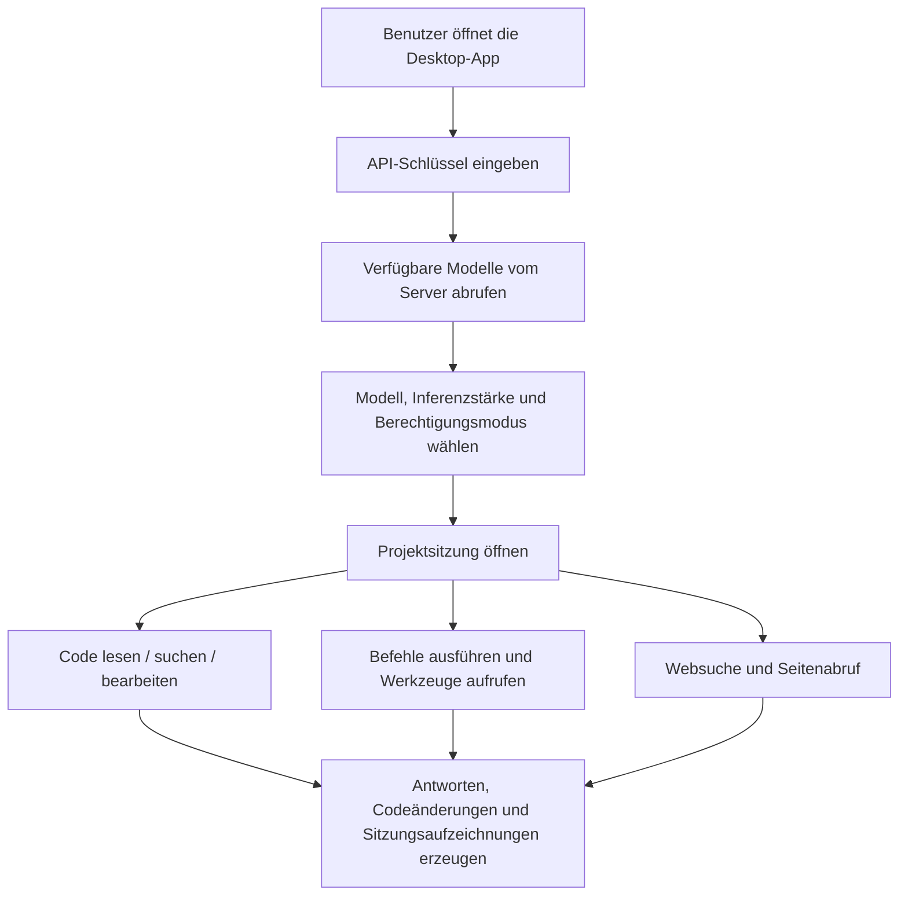

# Baibai Guochan LLM

<div align="center">

[](README.md)
[](README.en.md)
[](README.zh-TW.md)
[](README.ja.md)
[](README.ko.md)
[](README.es.md)
[](README.fr.md)
[](README.de.md)

</div>

Baibai Guochan LLM ist eine Desktop-Agent-Workbench, die auf [NanmiCoder/cc-haha](https://github.com/NanmiCoder/cc-haha) basiert und angepasst wurde. Sie bietet normalen Nutzern eine sofort einsatzbereite Windows-/macOS-/Linux-Oberfläche.

Diese Version verbindet sich standardmäßig mit `https://ai.xkxkbbk.cloud`. Geben Sie beim ersten Start Ihren Schlüssel ein, um die Modelle abzurufen und zu beginnen. Die eingebauten Code-Agent-Tools unterstützen Projektverzeichnisse, Datei lesen/bearbeiten, Befehlsausführung, Websuche, Aufgabenlisten und Sitzungsverwaltung.

## Download

Offizielle Installer werden auf GitHub Releases bereitgestellt:

[Neueste Version herunterladen](https://github.com/bai936191-afk/baibai-guochan-llm/releases/latest)

Aktuelle Version: `v0.4.3`

| OS | Empfohlene Datei |
| --- | --- |
| Windows x64 | `Baibai-Guochan-LLM-0.4.3-win-x64.exe` |
| macOS Apple Silicon | `Baibai-Guochan-LLM-0.4.3-mac-arm64.dmg` |
| macOS Intel | `Baibai-Guochan-LLM-0.4.3-mac-x64.dmg` |
| Linux x64 | `Baibai-Guochan-LLM-0.4.3-linux-x86_64.AppImage` oder `Baibai-Guochan-LLM-0.4.3-linux-amd64.deb` |
| Linux ARM64 | `Baibai-Guochan-LLM-0.4.3-linux-arm64.AppImage` oder `Baibai-Guochan-LLM-0.4.3-linux-arm64.deb` |

> Der aktuelle Build ist nicht mit einem kommerziellen Code-Signaturzertifikat signiert. Windows und macOS können beim ersten Installieren eine Sicherheitsabfrage anzeigen — das ist bei nicht signierten Installern normal.
> Die Download-Dateinamen verwenden ASCII, aber der Name der installierten App wird weiterhin als „白白国产大模型" angezeigt.

## Produktbauplan



### Abgeschlossen

- Desktop-Installer: Windows x64, macOS ARM64, macOS x64, Linux x64, Linux ARM64.
- Standard-Service-Endpunkt: `https://ai.xkxkbbk.cloud`.
 Schlüssel-Eingabe beim ersten Start.
- Abruf der Modellliste vom Server, ohne Abhängigkeit von festen offiziellen Modellen.
- Eingebaute Agent-Tools: Datei, Suche, Befehl, Web, Aufgabe, Notizen usw.
- Kompatibilität für Tool-Aufrufe mit chinesischen Verzeichnissen und chinesischen Dateinamen.
- Grundlegende chinesische Oberfläche und chinesische Installationsanleitung.
- Sitzungsoperationen: Export, Sitzungs-ID kopieren, zu diesem Punkt zurückspulen usw.
- Automatisches Plattform-übergreifendes Packaging mit GitHub Actions.
- Langfristiger Download-Einstieg in Releases.

### Mehrsprachiger Bauplan

| Phase | Sprache und Umfang |
| --- | --- |
| Aktuelle Version | Vereinfachtes Chinesisch als Basis, einige englische Fachbegriffe beibehalten. |
| Nächste Phase | English-Oberfläche, README, Release Notes und Installationsanleitung hinzufügen. |
| Spätere Erweiterung | Unterstützung für Traditionelles Chinesisch, Japanisch, 한국어, Español, Français, Deutsch usw. |
| Abdeckung | Hauptoberfläche, Einstellungsseite, Berechtigungsdialoge, Fehlermeldungen, Modellfähigkeits-Labels, Installer-Texte, Update-Hinweise. |

### Weitere Pläne

- Ordnungsgemäße Code-Signatur hinzufügen, um Windows-SmartScreen- und macOS-Gatekeeper-Hinweise zu reduzieren.
- Anzeige der Modellfähigkeiten verbessern, sodass Inferenz-, Bild- und Kontextfenster-Informationen vollständig vom Server kommen.
- Mehrsprachiges System vervollständigen, sodass Nutzer in den Einstellungen die Sprache wechseln können.
- Auto-Update-Pipeline vervollständigen, wobei die `latest*.yml`-Metadaten aus Releases priorisiert werden.
- Fehlertoleranz bei Tool-Aufrufen erhöhen und weiterhin gelegentlich falsche Parameternamen von Modellen tolerieren.
- Weitere End-to-End-Tests hinzufügen, die Dateianhänge, Bildanhänge, lange Sitzungen und Unterbrechungswiederherstellung abdecken.

## Installation

### Windows

1. Laden Sie `Baibai-Guochan-LLM-0.4.3-win-x64.exe` herunter.
2. Doppelklick auf den Installer, um ihn auszuführen.
3. Wählen Sie den Installationspfad und schließen Sie die Installation ab.
4. Öffnen Sie die Desktop-Verknüpfung und geben Sie Ihren Schlüssel ein.

### macOS

1. Laden Sie je nach Chip `mac-arm64.dmg` oder `mac-x64.dmg` herunter.
2. Öffnen Sie das DMG und ziehen Sie die App in Applications.
3. Wenn das System meldet, dass sie nicht geöffnet werden kann, gehen Sie zur Sicherheitsseite in den Systemeinstellungen und erlauben Sie es einmal, oder verwenden Sie den Helfer `install-macos-unsigned.sh` aus dem Release.

### Linux

AppImage:

```bash
chmod +x Baibai-Guochan-LLM-0.4.3-linux-x86_64.AppImage
./Baibai-Guochan-LLM-0.4.3-linux-x86_64.AppImage
```

Debian / Ubuntu:

```bash
sudo apt install ./Baibai-Guochan-LLM-0.4.3-linux-amd64.deb
```

Für ARM64-Geräte verwenden Sie das Paket, dessen Dateiname `arm64` enthält.

## Entwicklung

```bash
bun install
cd desktop
bun install
bun run dev
```

Übliche Validierung:

```bash
cd desktop
bun run lint
bun test ../scripts/quality-gate/package-smoke/index.test.ts
```

Lokales Windows-Packaging:

```powershell
cd desktop
bun run build:windows-x64
```

## Upstream-Erklärung

Dieses Projekt ist eine angepasste Version auf Basis von [NanmiCoder/cc-haha](https://github.com/NanmiCoder/cc-haha). Bitte behalten Sie die Erklärung, die Lizenz und den Haftungsausschluss des Upstream-Projekts bei.

Das Upstream-Projekt wird aus dem Claude-Code-Quellcode wiederhergestellt, der am 2026-03-31 aus dem npm-Registry von Anthropic geleakt wurde, und ist nur für Studium und Forschung gedacht. Die Urheberrechte am ursprünglichen Quellcode liegen bei Anthropic.

## Lizenz und Versionshinweise

- Dieses Repo empfiehlt derzeit, die Veröffentlichung privat zu halten.
- Prüfen Sie vor Weiterverbreitung, Open-Sourcing oder kommerzieller Nutzung zuerst die Upstream-Lizenz und die Risiken bezüglich der Code-Herkunft.
- Die Installer in Releases werden von GitHub Actions gebaut und sind nicht mit einem kommerziellen Code-Signaturzertifikat signiert.
