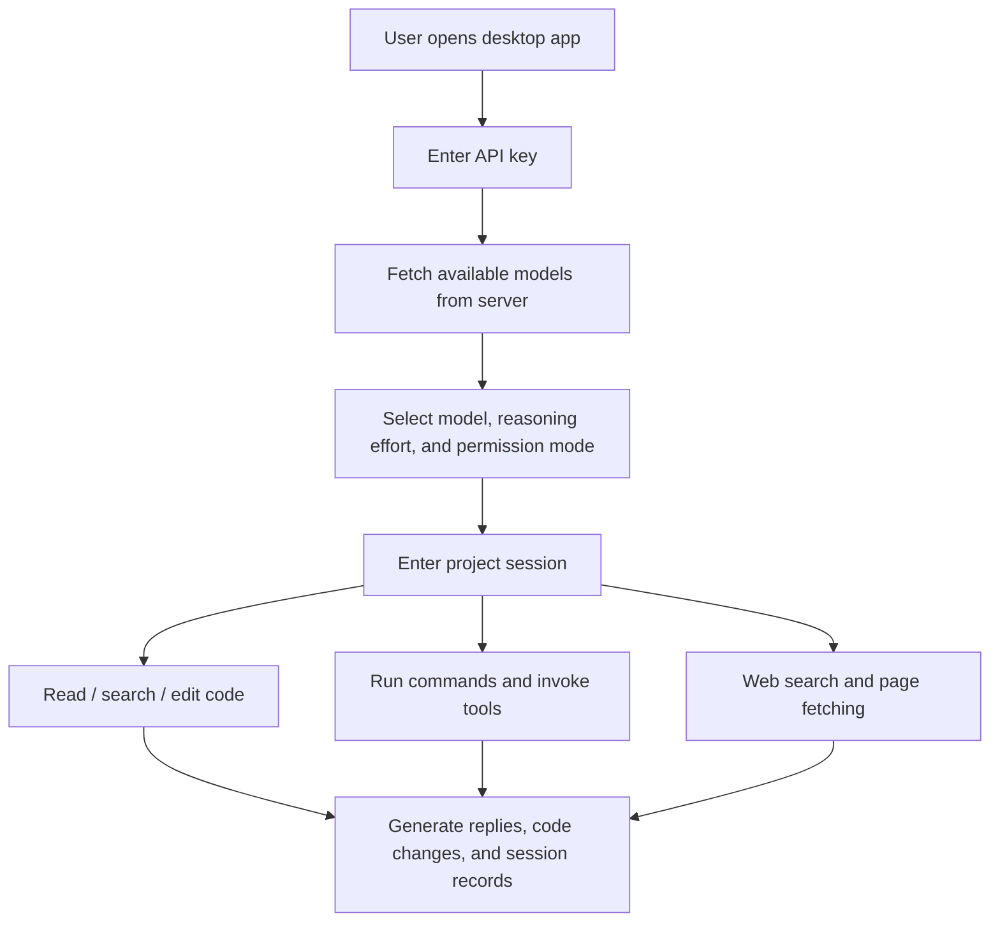

# Baibai Guochan LLM

<div align="center">

[](README.md)
[](README.en.md)
[](README.zh-TW.md)
[](README.ja.md)
[](README.ko.md)
[](README.es.md)
[](README.fr.md)
[](README.de.md)

</div>

Baibai Guochan LLM is a desktop Agent workbench customized from [NanmiCoder/cc-haha](https://github.com/NanmiCoder/cc-haha), offering an out-of-the-box Windows / macOS / Linux GUI for ordinary users.

This build connects to `https://ai.xkxkbbk.cloud` by default. Enter your key on first launch to fetch models and start using it. Built-in code Agent tools support project directories, file read/edit, command execution, web search, task lists, and session management.

## Download

Official installers are hosted on GitHub Releases:

[Download the latest version](https://github.com/bai936191-afk/baibai-guochan-llm/releases/latest)

Current version: `v0.4.3`

| OS | Recommended file |
| --- | --- |
| Windows x64 | `Baibai-Guochan-LLM-0.4.3-win-x64.exe` |
| macOS Apple Silicon | `Baibai-Guochan-LLM-0.4.3-mac-arm64.dmg` |
| macOS Intel | `Baibai-Guochan-LLM-0.4.3-mac-x64.dmg` |
| Linux x64 | `Baibai-Guochan-LLM-0.4.3-linux-x86_64.AppImage` or `Baibai-Guochan-LLM-0.4.3-linux-amd64.deb` |
| Linux ARM64 | `Baibai-Guochan-LLM-0.4.3-linux-arm64.AppImage` or `Baibai-Guochan-LLM-0.4.3-linux-arm64.deb` |

> The current build is not signed with a commercial code-signing certificate. Windows and macOS may show a security confirmation on first install — this is normal for unsigned installers.
> Download filenames use ASCII, but the installed app name still displays as "白白国产大模型".

## Product Blueprint



### Completed

- Desktop installers: Windows x64, macOS ARM64, macOS x64, Linux x64, Linux ARM64.
- Default service endpoint: `https://ai.xkxkbbk.cloud`.
- First-launch key entry flow.
- Fetch model list from server, no longer relying on fixed official models.
- Built-in Agent tools: file, search, command, web, task, notes, etc.
- Compatibility for Chinese directory and Chinese filename tool calls.
- Basic Chinese UI and Chinese install instructions.
- Session operations: export, copy session ID, rewind to this point, etc.
- GitHub Actions auto-packaging for all platforms.
- Long-term Release download entry.

### Multi-language Blueprint

| Phase | Language and scope |
| --- | --- |
| Current version | Simplified Chinese first, with some English technical terms retained. |
| Next phase | Add English UI, README, Release Notes, and install instructions. |
| Future expansion | Support Traditional Chinese, Japanese, 한국어, Español, Français, Deutsch language packs. |
| Coverage | Main UI, settings page, permission dialogs, error messages, model capability tags, installer copy, update notes. |

### Future Plans

- Add proper code signing to reduce Windows SmartScreen and macOS Gatekeeper prompts.
- Improve model capability display so reasoning, image, and context-window info comes entirely from the server.
- Complete the multi-language system to let users switch language in settings.
- Complete the auto-update pipeline, prioritizing `latest*.yml` metadata from Releases.
- Harden tool-call error tolerance, continuing to tolerate occasional wrong parameter names from models.
- Add more end-to-end tests covering file attachments, image attachments, long sessions, and interruption recovery.

## Installation

### Windows

1. Download `Baibai-Guochan-LLM-0.4.3-win-x64.exe`.
2. Double-click the installer.
3. Choose the install path and finish installation.
4. Open the desktop shortcut and enter your key.

### macOS

1. Download `mac-arm64.dmg` or `mac-x64.dmg` depending on your chip.
2. Open the DMG and drag the app into Applications.
3. If the system says it cannot be opened, go to the Security pane in System Settings and allow it once, or use the `install-macos-unsigned.sh` helper from the Release.

### Linux

AppImage:

```bash
chmod +x Baibai-Guochan-LLM-0.4.3-linux-x86_64.AppImage
./Baibai-Guochan-LLM-0.4.3-linux-x86_64.AppImage
```

Debian / Ubuntu:

```bash
sudo apt install ./Baibai-Guochan-LLM-0.4.3-linux-amd64.deb
```

For ARM64 devices, use the package whose filename contains `arm64`.

## Development

```bash
bun install
cd desktop
bun install
bun run dev
```

Common validation:

```bash
cd desktop
bun run lint
bun test ../scripts/quality-gate/package-smoke/index.test.ts
```

Local Windows packaging:

```powershell
cd desktop
bun run build:windows-x64
```

## Upstream Declaration

This project is a customized build based on [NanmiCoder/cc-haha](https://github.com/NanmiCoder/cc-haha). Please retain the upstream project declaration, license, and disclaimer.

The upstream project is repaired from the Claude Code source leaked from Anthropic's npm registry on 2026-03-31, and is for study and research only. The original source copyright belongs to Anthropic.

## License and Release Notes

- This repo currently recommends staying private.
- Before redistributing, open-sourcing, or commercial use, first confirm upstream license and related code-source risks.
- Installers in Releases are built by GitHub Actions and are not signed with a commercial code-signing certificate.
