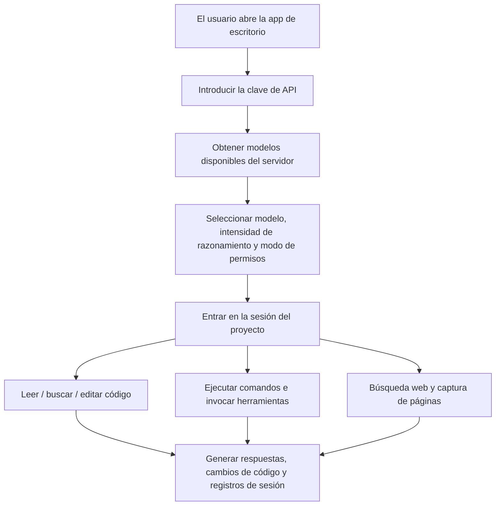

# Baibai Guochan LLM

<div align="center">

[](README.md)
[](README.en.md)
[](README.zh-TW.md)
[](README.ja.md)
[](README.ko.md)
[](README.es.md)
[](README.fr.md)
[](README.de.md)

</div>

Baibai Guochan LLM es un workbench de Agent de escritorio personalizado a partir de [NanmiCoder/cc-haha](https://github.com/NanmiCoder/cc-haha), que ofrece una interfaz gráfica lista para usar en Windows / macOS / Linux para usuarios comunes.

Esta versión se conecta por defecto a `https://ai.xkxkbbk.cloud`. Ingresa tu clave en el primer inicio para obtener los modelos y comenzar a usarla. Incorpora las herramientas habituales de un Agent de código, y soporta directorios de proyecto, lectura y edición de archivos, ejecución de comandos, búsqueda web, listas de tareas y gestión de sesiones.

## Descarga

Los instaladores oficiales se publican en GitHub Releases:

[Descargar la última versión](https://github.com/bai936191-afk/baibai-guochan-llm/releases/latest)

Versión actual: `v0.4.4`

| SO | Archivo recomendado |
| --- | --- |
| Windows x64 | `Baibai-Guochan-LLM-0.4.4-win-x64.exe` |
| macOS Apple Silicon | `Baibai-Guochan-LLM-0.4.4-mac-arm64.dmg` |
| macOS Intel | `Baibai-Guochan-LLM-0.4.4-mac-x64.dmg` |
| Linux x64 | `Baibai-Guochan-LLM-0.4.4-linux-x86_64.AppImage` o `Baibai-Guochan-LLM-0.4.4-linux-amd64.deb` |
| Linux ARM64 | `Baibai-Guochan-LLM-0.4.4-linux-arm64.AppImage` o `Baibai-Guochan-LLM-0.4.4-linux-arm64.deb` |

> La compilación actual no cuenta con firma de código comercial. En Windows y macOS puede aparecer una confirmación de seguridad del sistema en la primera instalación; es un comportamiento normal para instaladores no firmados.
> Los nombres de archivo de descarga usan ASCII, pero el nombre de la aplicación instalada sigue mostrándose como "白白国产大模型".

## Diagrama de Producto



### Completado

- Instaladores de escritorio: Windows x64, macOS ARM64, macOS x64, Linux x64, Linux ARM64.
- Endpoint de servicio predeterminado: `https://ai.xkxkbbk.cloud`.
- Flujo de entrada de clave en el primer inicio.
- Obtención de la lista de modelos desde el servidor, sin depender de modelos oficiales fijos.
- Herramientas de Agent integradas: archivo, búsqueda, comando, web, tarea, notas, etc.
- Compatibilidad con llamadas a herramientas en directorios y nombres de archivo en chino.
- Interfaz básica en chino e instrucciones de instalación en chino.
- Operaciones de sesión: exportar, copiar ID de sesión, rebobinar hasta este punto, etc.
- Empaquetado automático multiplataforma con GitHub Actions.
- Entrada de descarga a largo plazo en Releases.

### Diagrama multilingüe

| Fase | Idioma y alcance |
| --- | --- |
| Versión actual | Chino simplificado como base, conservando algunos términos técnicos en inglés. |
| Próxima fase | Añadir interfaz en English, README, Release Notes e instrucciones de instalación. |
| Expansión futura | Soporte para chino tradicional, japonés, 한국어, Español, Français, Deutsch, etc. |
| Cobertura | Interfaz principal, página de ajustes, diálogos de permisos, mensajes de error, etiquetas de capacidad del modelo, textos del instalador, notas de actualización. |

### Planes futuros

- Añadir firma de código formal para reducir los avisos de Windows SmartScreen y macOS Gatekeeper.
- Mejorar la visualización de capacidades del modelo para que el razonamiento, la imagen y la ventana de contexto provengan completamente del servidor.
- Completar el sistema multilingüe para que los usuarios puedan cambiar de idioma en los ajustes.
- Completar el flujo de actualización automática, priorizando los metadatos `latest*.yml` de Releases.
- Reforzar la tolerancia a errores en llamadas a herramientas, tolerando los nombres de parámetros incorrectos ocasionales de los modelos.
- Añadir más pruebas de extremo a extremo que cubran archivos adjuntos, imágenes adjuntas, sesiones largas y recuperación de interrupciones.

## Instalación

### Windows

1. Descarga `Baibai-Guochan-LLM-0.4.4-win-x64.exe`.
2. Doble clic en el instalador para ejecutarlo.
3. Elige la ruta de instalación y completa la instalación.
4. Abre el acceso directo del escritorio e ingresa tu clave.

### macOS

1. Descarga `mac-arm64.dmg` o `mac-x64.dmg` según tu chip.
2. Abre el DMG y arrastra la app a Applications.
3. Si el sistema indica que no se puede abrir, ve a la página de seguridad de los ajustes del sistema y permite una vez, o usa el asistente `install-macos-unsigned.sh` del Release.

### Linux

AppImage:

```bash
chmod +x Baibai-Guochan-LLM-0.4.4-linux-x86_64.AppImage
./Baibai-Guochan-LLM-0.4.4-linux-x86_64.AppImage
```

Debian / Ubuntu:

```bash
sudo apt install ./Baibai-Guochan-LLM-0.4.4-linux-amd64.deb
```

Para dispositivos ARM64, usa el paquete cuyo nombre contiene `arm64`.

## Desarrollo

```bash
bun install
cd desktop
bun install
bun run dev
```

Validación común:

```bash
cd desktop
bun run lint
bun test ../scripts/quality-gate/package-smoke/index.test.ts
```

Empaquetado local de Windows:

```powershell
cd desktop
bun run build:windows-x64
```

## Declaración upstream

Este proyecto es una versión personalizada basada en [NanmiCoder/cc-haha](https://github.com/NanmiCoder/cc-haha). Conserva la declaración, la licencia y la exención de responsabilidad del proyecto upstream.

El proyecto upstream se repara a partir del código fuente de Claude Code filtrado del registro npm de Anthropic el 2026-03-31, y es solo para estudio e investigación. Los derechos de autor del código fuente original pertenecen a Anthropic.

## Licencia y notas de lanzamiento

- Este repositorio recomienda por ahora mantener un lanzamiento privado.
- Antes de redistribuir, abrir el código fuente o hacer uso comercial, confirma primero los riesgos de la licencia upstream y del origen del código relacionado.
- Los instaladores de Releases son construidos por GitHub Actions y no están firmados con un certificado de firma de código comercial.
