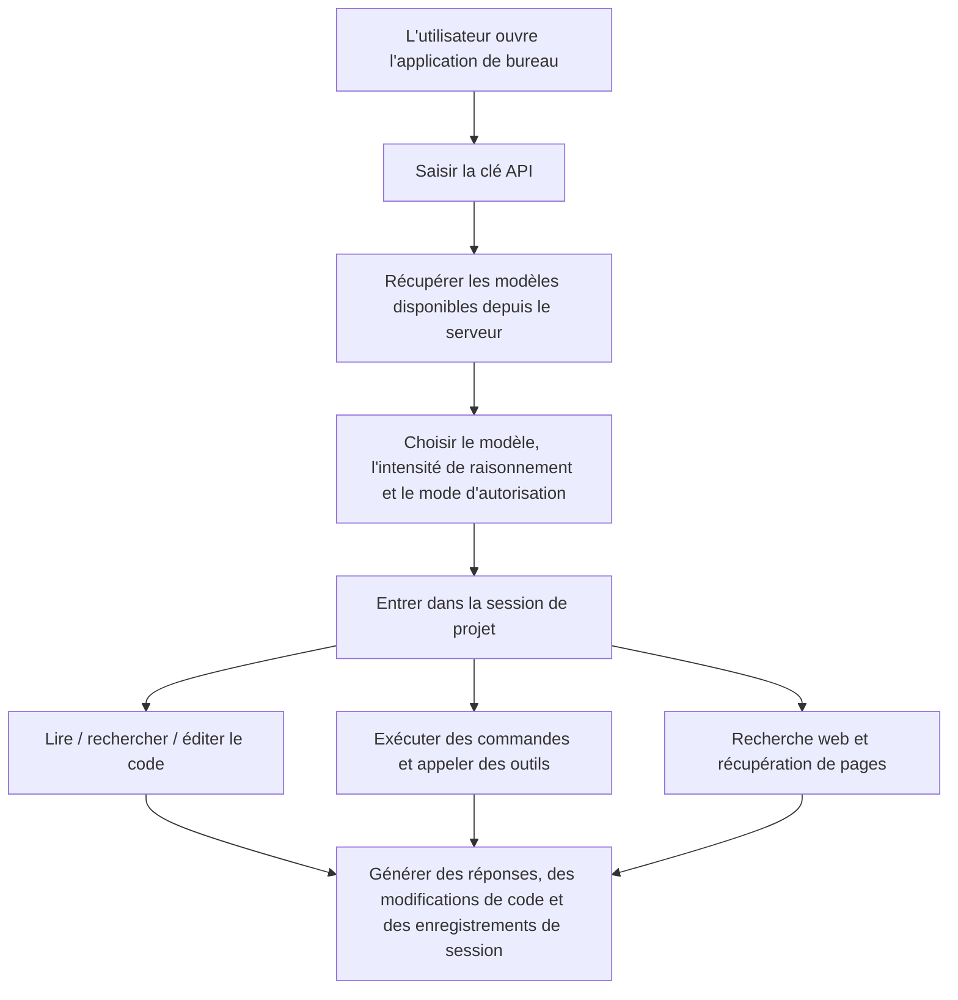

# Baibai Guochan LLM

<div align="center">

[](README.md)
[](README.en.md)
[](README.zh-TW.md)
[](README.ja.md)
[](README.ko.md)
[](README.es.md)
[](README.fr.md)
[](README.de.md)

</div>

Baibai Guochan LLM est un workbench Agent pour poste de travail personnalisé à partir de [NanmiCoder/cc-haha](https://github.com/NanmiCoder/cc-haha), offrant une interface graphique Windows / macOS / Linux prête à l'emploi pour les utilisateurs ordinaires.

Cette version se connecte par défaut à `https://ai.xkxkbbk.cloud`. Saisissez votre clé au premier lancement pour récupérer les modèles et commencer à l'utiliser. Les outils Agent de code intégrés prennent en charge les répertoires de projet, la lecture et l'édition de fichiers, l'exécution de commandes, la recherche web, les listes de tâches et la gestion des sessions.

## Téléchargement

Les installateurs officiels sont publiés sur GitHub Releases :

[Télécharger la dernière version](https://github.com/bai936191-afk/baibai-guochan-llm/releases/latest)

Version actuelle : `v0.4.3`

| OS | Fichier recommandé |
| --- | --- |
| Windows x64 | `Baibai-Guochan-LLM-0.4.3-win-x64.exe` |
| macOS Apple Silicon | `Baibai-Guochan-LLM-0.4.3-mac-arm64.dmg` |
| macOS Intel | `Baibai-Guochan-LLM-0.4.3-mac-x64.dmg` |
| Linux x64 | `Baibai-Guochan-LLM-0.4.3-linux-x86_64.AppImage` ou `Baibai-Guochan-LLM-0.4.3-linux-amd64.deb` |
| Linux ARM64 | `Baibai-Guochan-LLM-0.4.3-linux-arm64.AppImage` ou `Baibai-Guochan-LLM-0.4.3-linux-arm64.deb` |

> La build actuelle n'est pas signée avec un certificat de signature de code commercial. Sous Windows et macOS, une confirmation de sécurité du système peut apparaître lors de la première installation — c'est un comportement normal pour les installateurs non signés.
> Les noms de fichiers téléchargés utilisent l'ASCII, mais le nom de l'application installée s'affiche toujours comme « 白白国产大模型 ».

## Diagramme de Produit



### Terminé

- Installateurs de bureau : Windows x64, macOS ARM64, macOS x64, Linux x64, Linux ARM64.
- Point de service par défaut : `https://ai.xkxkbbk.cloud`.
- Flux de saisie de clé au premier lancement.
- Récupération de la liste des modèles depuis le serveur, sans dépendre de modèles officiels fixes.
- Outils Agent intégrés : fichier, recherche, commande, web, tâche, notes, etc.
- Compatibilité avec les appels d'outils pour répertoires et noms de fichiers en chinois.
- Interface de base en chinois et instructions d'installation en chinois.
- Opérations de session : export, copie de l'ID de session, retour à ce point, etc.
- Empaquetage automatique multiplateforme par GitHub Actions.
- Entrée de téléchargement à long terme dans les Releases.

### Diagramme multilingue

| Phase | Langue et portée |
| --- | --- |
| Version actuelle | Chinois simplifié en priorité, avec certains termes techniques en anglais conservés. |
| Phase suivante | Ajouter l'interface English, le README, les Release Notes et les instructions d'installation. |
| Expansion future | Prise en charge du chinois traditionnel, japonais, 한국어, Español, Français, Deutsch, etc. |
| Couverture | Interface principale, page de réglages, boîtes de dialogue d'autorisation, messages d'erreur, étiquettes de capacité du modèle, textes de l'installateur, notes de mise à jour. |

### Plans futurs

- Ajouter une signature de code formelle pour réduire les avertissements Windows SmartScreen et macOS Gatekeeper.
- Améliorer l'affichage des capacités du modèle afin que le raisonnement, l'image et la fenêtre de contexte proviennent entièrement du serveur.
- Compléter le système multilingue pour permettre aux utilisateurs de changer de langue dans les réglages.
- Compléter le pipeline de mise à jour automatique, en priorisant les métadonnées `latest*.yml` des Releases.
- Renforcer la tolérance aux erreurs des appels d'outils, en continuant à tolérer les noms de paramètres incorrects occasionnels des modèles.
- Ajouter davantage de tests de bout en bout couvrant les pièces jointes, les images jointes, les sessions longues et la récupération après interruption.

## Installation

### Windows

1. Téléchargez `Baibai-Guochan-LLM-0.4.3-win-x64.exe`.
2. Double-cliquez sur l'installateur pour l'exécuter.
3. Choisissez le chemin d'installation et terminez l'installation.
4. Ouvrez le raccourci sur le bureau et saisissez votre clé.

### macOS

1. Téléchargez `mac-arm64.dmg` ou `mac-x64.dmg` selon votre puce.
2. Ouvrez le DMG et glissez l'application dans Applications.
3. Si le système indique qu'elle ne peut pas être ouverte, allez dans la page Sécurité des réglages système pour autoriser une fois, ou utilisez l'assistant `install-macos-unsigned.sh` du Release.

### Linux

AppImage :

```bash
chmod +x Baibai-Guochan-LLM-0.4.3-linux-x86_64.AppImage
./Baibai-Guochan-LLM-0.4.3-linux-x86_64.AppImage
```

Debian / Ubuntu :

```bash
sudo apt install ./Baibai-Guochan-LLM-0.4.3-linux-amd64.deb
```

Pour les appareils ARM64, utilisez le paquet dont le nom contient `arm64`.

## Développement

```bash
bun install
cd desktop
bun install
bun run dev
```

Validation courante :

```bash
cd desktop
bun run lint
bun test ../scripts/quality-gate/package-smoke/index.test.ts
```

Empaquetage local Windows :

```powershell
cd desktop
bun run build:windows-x64
```

## Déclaration upstream

Ce projet est une version personnalisée basée sur [NanmiCoder/cc-haha](https://github.com/NanmiCoder/cc-haha). Veuillez conserver la déclaration, la licence et la clause de non-responsabilité du projet upstream.

Le projet upstream est réparé à partir du code source de Claude Code fuité du registre npm d'Anthropic le 2026-03-31, et est destiné uniquement à l'étude et à la recherche. Les droits d'auteur du code source original appartiennent à Anthropic.

## Licence et notes de publication

- Ce dépôt recommande actuellement de rester en publication privée.
- Avant toute redistribution, ouverture open source ou utilisation commerciale, confirmez d'abord la licence upstream et les risques liés à l'origine du code.
- Les installateurs des Releases sont construits par GitHub Actions et ne sont pas signés avec un certificat de signature de code commercial.
