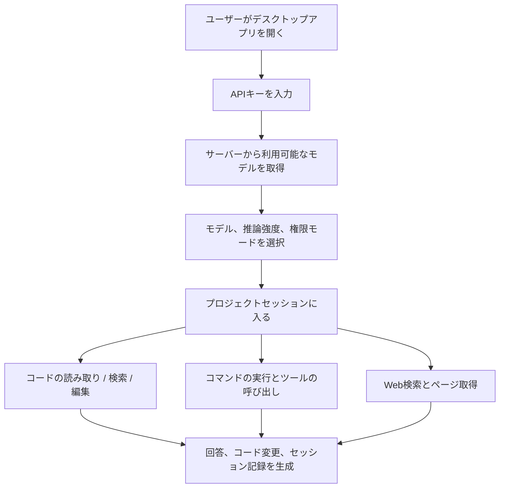

# 白白国産大モデル

<div align="center">

[](README.md)
[](README.en.md)
[](README.zh-TW.md)
[](README.ja.md)
[](README.ko.md)
[](README.es.md)
[](README.fr.md)
[](README.de.md)

</div>

白白国産大モデルは [NanmiCoder/cc-haha](https://github.com/NanmiCoder/cc-haha) をベースにカスタマイズしたデスクトップ向け Agent ワークベンチで、一般ユーザー向けに Windows / macOS / Linux の GUI をすぐに使える形で提供します。

本バージョンはデフォルトで `https://ai.xkxkbbk.cloud` に接続します。初回起動時にキーを入力すればモデルを取得して利用を開始できます。コード Agent の主要ツールを内蔵し、プロジェクトディレクトリ、ファイルの読み取りと編集、コマンド実行、ウェブ検索、タスクリスト、セッション管理などをサポートします。

## ダウンロード

正式なインストーラは GitHub Releases で公開しています：

[最新版をダウンロード](https://github.com/bai936191-afk/baibai-guochan-llm/releases/latest)

現在のバージョン：`v0.4.4`

| OS | 推奨ファイル |
| --- | --- |
| Windows x64 | `Baibai-Guochan-LLM-0.4.4-win-x64.exe` |
| macOS Apple Silicon | `Baibai-Guochan-LLM-0.4.4-mac-arm64.dmg` |
| macOS Intel | `Baibai-Guochan-LLM-0.4.4-mac-x64.dmg` |
| Linux x64 | `Baibai-Guochan-LLM-0.4.4-linux-x86_64.AppImage` または `Baibai-Guochan-LLM-0.4.4-linux-amd64.deb` |
| Linux ARM64 | `Baibai-Guochan-LLM-0.4.4-linux-arm64.AppImage` または `Baibai-Guochan-LLM-0.4.4-linux-arm64.deb` |

> 現在のビルドは商業用コード署名を設定していません。Windows と macOS の初回インストール時にシステムのセキュリティ確認が表示される場合がありますが、これは未署名インストーラでは正常な動作です。
> ダウンロードファイル名は ASCII を使用しますが、インストール後のアプリ名は「白白国产大模型」と表示されます。

## 製品ブループリント



### 完了

- デスクトップ版インストーラ：Windows x64、macOS ARM64、macOS x64、Linux x64、Linux ARM64。
- デフォルトのサービスエンドポイント：`https://ai.xkxkbbk.cloud`。
- 初回起動時のキー入力フロー。
- サーバーからモデルリストを取得し、固定の公式モデルに依存しない仕組み。
- 内蔵 Agent ツール：ファイル、検索、コマンド、ウェブ、タスク、ノートなど。
- 中国語ディレクトリと中国語ファイル名のツール呼び出し互換性。
- 基本的な中国語 UI と中国語インストール手順。
- セッション操作：エクスポート、セッション ID のコピー、この時点まで巻き戻しなど。
- GitHub Actions による全プラットフォーム自動パッケージ化。
- Release の長期ダウンロード入口。

### 多言語ブループリント

| フェーズ | 言語と範囲 |
| --- | --- |
| 現在のバージョン | 簡体字中国語を主軸に、一部の英語技術用語を維持。 |
| 次のフェーズ | English の UI、README、Release Notes、インストール手順を追加。 |
| 今後の拡張 | 繁体字中国語、日本語、한국어、Español、Français、Deutsch などの言語パックをサポート。 |
| カバレッジ | メイン UI、設定ページ、権限ダイアログ、エラーメッセージ、モデル能力ラベル、インストーラ文案、更新説明。 |

### 今後の計画

- 正式なコード署名を追加し、Windows SmartScreen と macOS Gatekeeper の警告を減らす。
- モデル能力表示を改善し、推論、画像、コンテキストウィンドウ情報を完全にサーバーから取得する。
- 多言語システムを完成させ、設定で言語切替を可能にする。
- 自動更新パイプラインを完成させ、Release の `latest*.yml` メタデータを優先対応する。
- ツール呼び出しのエラー耐性を強化し、モデルが偶発的に出力する誤ったパラメータ名にも対応し続ける。
- ファイル添付、画像添付、長時間セッション、中断復旧をカバーするエンドツーエンドテストを追加する。

## インストール

### Windows

1. `Baibai-Guochan-LLM-0.4.4-win-x64.exe` をダウンロード。
2. インストーラをダブルクリックして実行。
3. インストール先を選択し、インストールを完了。
4. デスクトップのショートカットを開き、キーを入力。

### macOS

1. チップに応じて `mac-arm64.dmg` または `mac-x64.dmg` をダウンロード。
2. DMG を開き、アプリを Applications にドラッグ。
3. システムが開けないと表示した場合、システム設定のセキュリティページで一度許可するか、Release の `install-macos-unsigned.sh` ヘルパーを使用。

### Linux

AppImage：

```bash
chmod +x Baibai-Guochan-LLM-0.4.4-linux-x86_64.AppImage
./Baibai-Guochan-LLM-0.4.4-linux-x86_64.AppImage
```

Debian / Ubuntu：

```bash
sudo apt install ./Baibai-Guochan-LLM-0.4.4-linux-amd64.deb
```

ARM64 端末ではファイル名に `arm64` が含まれるパッケージを使用してください。

## 開発

```bash
bun install
cd desktop
bun install
bun run dev
```

常用の検証：

```bash
cd desktop
bun run lint
bun test ../scripts/quality-gate/package-smoke/index.test.ts
```

ローカルの Windows パッケージ化：

```powershell
cd desktop
bun run build:windows-x64
```

## 上流宣言

本プロジェクトは [NanmiCoder/cc-haha](https://github.com/NanmiCoder/cc-haha) をベースにしたカスタマイズ版です。上流プロジェクトの宣言、ライセンス、免責事項を保持してください。

上流プロジェクトは 2026-03-31 に Anthropic の npm registry から漏洩した Claude Code のソースコードを修復したもので、学習および研究目的のみに使用してください。元のソースコードの著作権は Anthropic に帰属します。

## ライセンスとリリースノート

- 本リポジトリは現在、非公開リリースを維持することを推奨します。
- 再配布、オープンソース化、商用利用の前に、上流ライセンスと関連コードの由来リスクを確認してください。
- Release のインストーラは GitHub Actions でビルドされ、商業用コード署名証明書は設定されていません。
