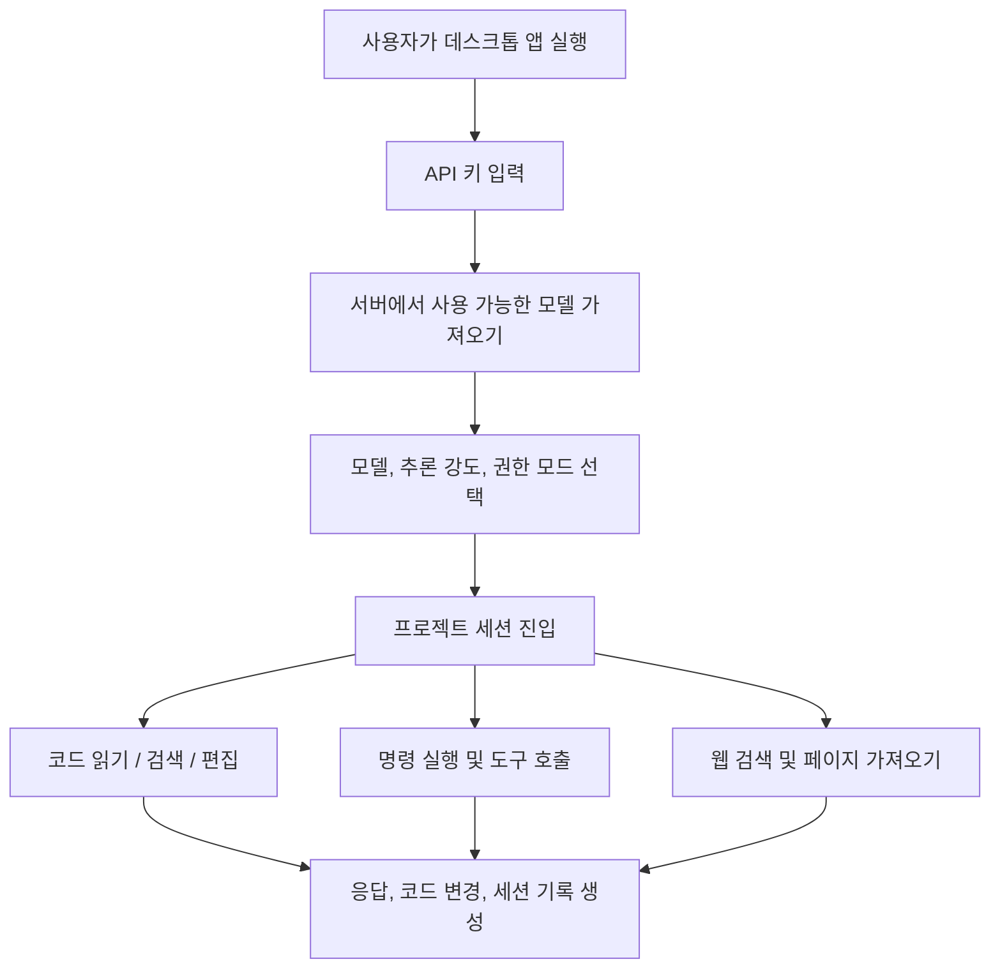

# 백백 국산 대모델

<div align="center">

[](README.md)
[](README.en.md)
[](README.zh-TW.md)
[](README.ja.md)
[](README.ko.md)
[](README.es.md)
[](README.fr.md)
[](README.de.md)

</div>

백백 국산 대모델은 [NanmiCoder/cc-haha](https://github.com/NanmiCoder/cc-haha)를 기반으로 커스터마이징한 데스크톱 Agent 워크벤치로, 일반 사용자에게 바로 사용할 수 있는 Windows / macOS / Linux GUI를 제공합니다.

본 버전은 기본적으로 `https://ai.xkxkbbk.cloud`에 연결됩니다. 첫 실행 시 키를 입력하면 모델을 가져와 사용을 시작할 수 있습니다. 코드 Agent의 주요 도구를 내장하여 프로젝트 디렉터리, 파일 읽기/편집, 명령 실행, 웹 검색, 작업 목록, 세션 관리 등을 지원합니다.

## 다운로드

공식 설치 패키지는 GitHub Releases에서 제공합니다:

[최신 버전 다운로드](https://github.com/bai936191-afk/baibai-guochan-llm/releases/latest)

현재 버전: `v0.4.4`

| OS | 추천 파일 |
| --- | --- |
| Windows x64 | `Baibai-Guochan-LLM-0.4.4-win-x64.exe` |
| macOS Apple Silicon | `Baibai-Guochan-LLM-0.4.4-mac-arm64.dmg` |
| macOS Intel | `Baibai-Guochan-LLM-0.4.4-mac-x64.dmg` |
| Linux x64 | `Baibai-Guochan-LLM-0.4.4-linux-x86_64.AppImage` 또는 `Baibai-Guochan-LLM-0.4.4-linux-amd64.deb` |
| Linux ARM64 | `Baibai-Guochan-LLM-0.4.4-linux-arm64.AppImage` 또는 `Baibai-Guochan-LLM-0.4.4-linux-arm64.deb` |

> 현재 빌드는 상용 코드 서명 인증서가 설정되어 있지 않습니다. Windows와 macOS는 첫 설치 시 시스템 보안 확인이 나타날 수 있으며, 이는 미서명 설치 패키지의 정상적인 동작입니다.
> 다운로드 파일명은 ASCII를 사용하지만, 설치 후 앱 이름은 여전히 "白白国产大模型"으로 표시됩니다.

## 제품 청사진



### 완료

- 데스크톱 설치 패키지: Windows x64, macOS ARM64, macOS x64, Linux x64, Linux ARM64.
- 기본 서비스 엔드포인트: `https://ai.xkxkbbk.cloud`.
- 첫 실행 시 키 입력 흐름.
- 서버에서 모델 목록을 가져와 고정된 공식 모델에 의존하지 않음.
- 내장 Agent 도구: 파일, 검색, 명령, 웹, 작업, 노트 등.
- 중국어 디렉터리와 중국어 파일명 도구 호출 호환성.
- 기본 중국어 UI 및 중국어 설치 안내.
- 세션 작업: 내보내기, 세션 ID 복사, 이 지점으로 되감기 등.
- GitHub Actions를 통한 전 플랫폼 자동 패키징.
- Release 장기 다운로드入口.

### 다국어 청사진

| 단계 | 언어와 범위 |
| --- | --- |
| 현재 버전 | 간체 중국어 위주, 일부 영어 기술 용어 유지. |
| 다음 단계 | English UI, README, Release Notes, 설치 안내 추가. |
| 향후 확장 | 번체 중국어, 일본어, 한국어, Español, Français, Deutsch 언어 팩 지원. |
| 커버리지 | 메인 UI, 설정 페이지, 권한 대화상자, 오류 메시지, 모델 능력 라벨, 설치 프로그램 문구, 업데이트 안내. |

### 향후 계획

- 정식 코드 서명을 추가하여 Windows SmartScreen과 macOS Gatekeeper 경고를 줄이기.
- 모델 능력 표시를 개선하여 추론, 이미지, 컨텍스트 창 정보를 완전히 서버에서 가져오기.
- 다국어 시스템을 완성하여 설정에서 언어 전환을 지원.
- 자동 업데이트 파이프라인을 완성하고 Release의 `latest*.yml` 메타데이터를 우선 지원.
- 도구 호출 오류 내성을 강화하여 모델이 간혹 출력하는 잘못된 매개변수 이름도 계속 호환.
- 파일 첨부, 이미지 첨부, 긴 세션, 중단 복구를 다루는 엔드투엔드 테스트 추가.

## 설치

### Windows

1. `Baibai-Guochan-LLM-0.4.4-win-x64.exe`를 다운로드.
2. 설치 프로그램을 더블클릭하여 실행.
3. 설치 경로를 선택하고 설치 완료.
4. 데스크톱 바로가기를 열고 키 입력.

### macOS

1. 칩에 따라 `mac-arm64.dmg` 또는 `mac-x64.dmg`를 다운로드.
2. DMG를 열고 앱을 Applications으로 드래그.
3. 시스템이 열 수 없다고 표시하면 시스템 설정의 보안 페이지에서 한 번 허용하거나, Release의 `install-macos-unsigned.sh` 도우미 사용.

### Linux

AppImage:

```bash
chmod +x Baibai-Guochan-LLM-0.4.4-linux-x86_64.AppImage
./Baibai-Guochan-LLM-0.4.4-linux-x86_64.AppImage
```

Debian / Ubuntu:

```bash
sudo apt install ./Baibai-Guochan-LLM-0.4.4-linux-amd64.deb
```

ARM64 기기에서는 파일명에 `arm64`가 포함된 패키지를 사용하세요.

## 개발

```bash
bun install
cd desktop
bun install
bun run dev
```

일반 검증:

```bash
cd desktop
bun run lint
bun test ../scripts/quality-gate/package-smoke/index.test.ts
```

로컬 Windows 패키징:

```powershell
cd desktop
bun run build:windows-x64
```

## 업스트림 선언

본 프로젝트는 [NanmiCoder/cc-haha](https://github.com/NanmiCoder/cc-haha)를 기반으로 한 커스터마이징 버전입니다. 업스트림 프로젝트 선언, 라이선스, 면책 조항을 유지하세요.

업스트림 프로젝트는 2026-03-31에 Anthropic의 npm registry에서 유출된 Claude Code 소스코드를 복구한 것으로, 학습 및 연구 목적으로만 사용하세요. 원본 소스코드의 저작권은 Anthropic에 귀속됩니다.

## 라이선스와 릴리스 노트

- 본 저장소는 현재 비공개 릴리스를 유지할 것을 권장합니다.
- 재배포, 오픈소스화, 상업적 사용 전에 먼저 업스트림 라이선스와 관련 코드 출처 리스크를 확인하세요.
- Release의 설치 패키지는 GitHub Actions로 빌드되며, 상용 코드 서명 인증서는 설정되어 있지 않습니다.
