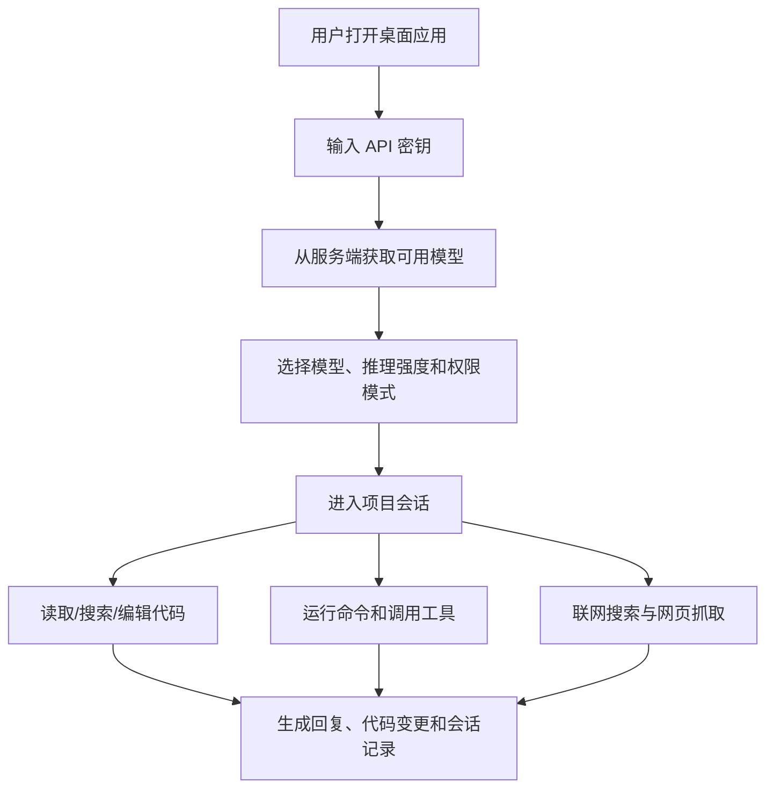
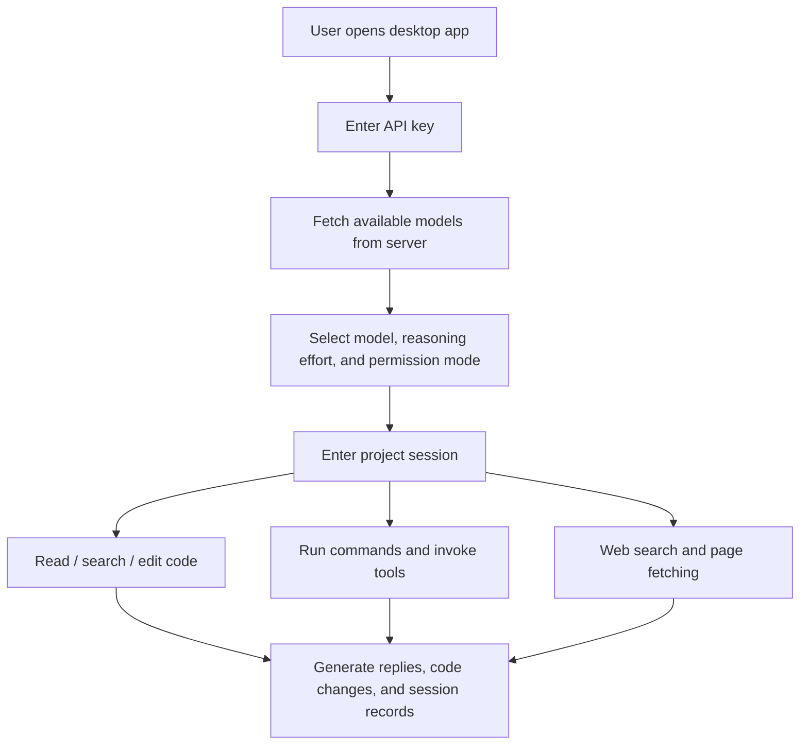
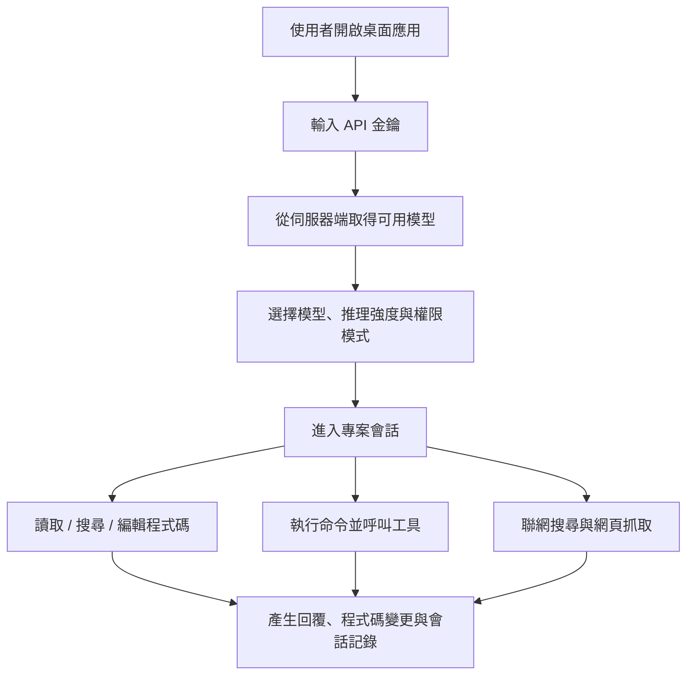
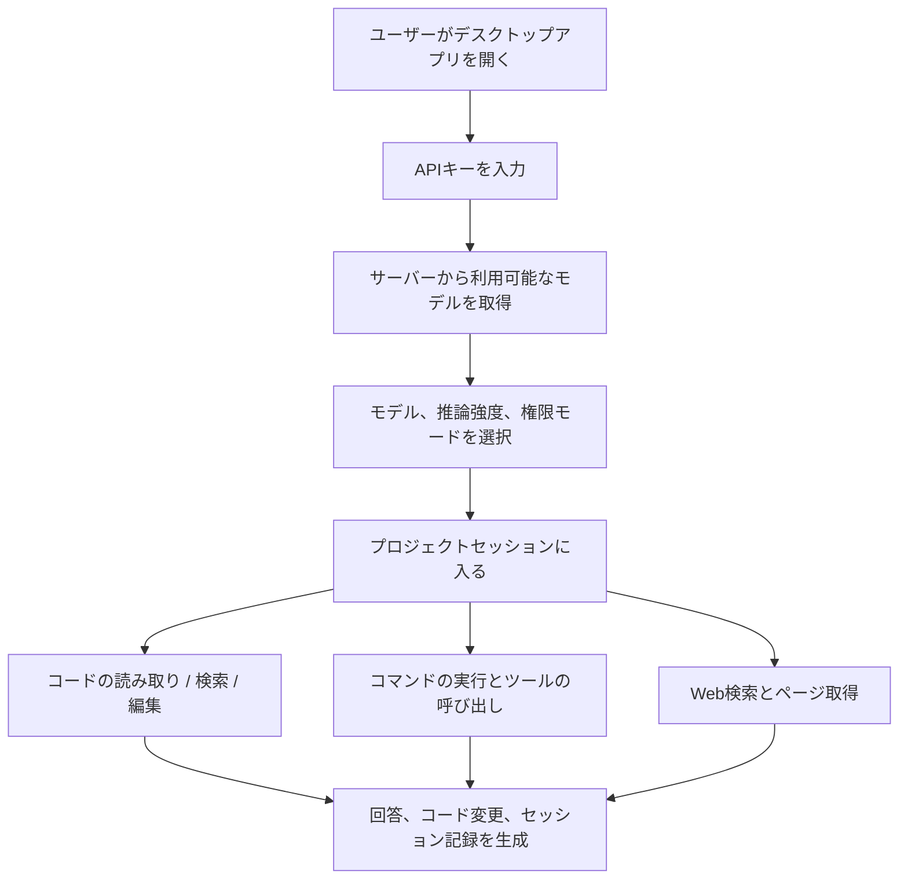
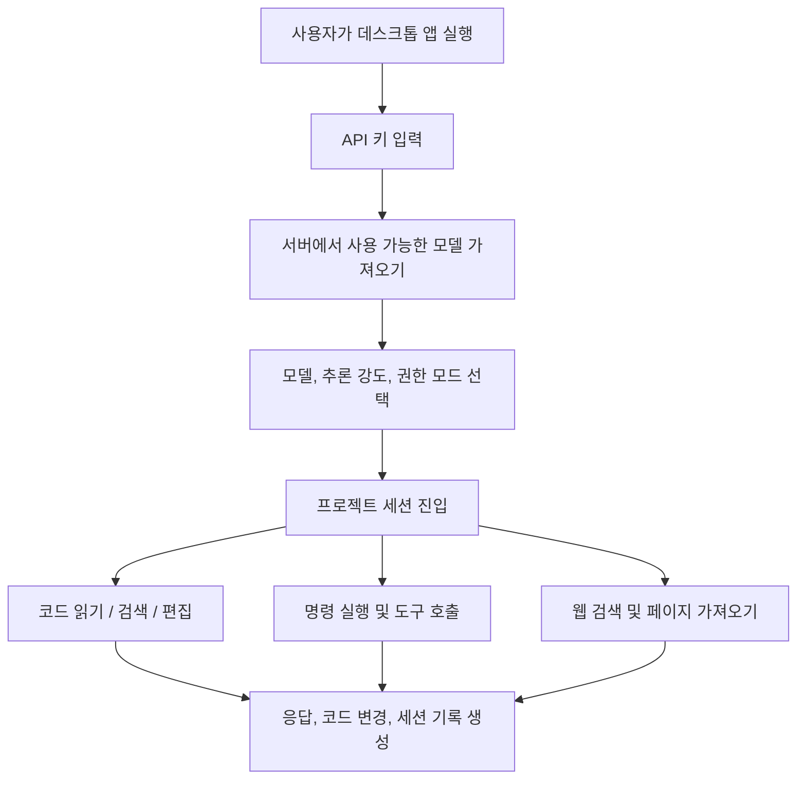
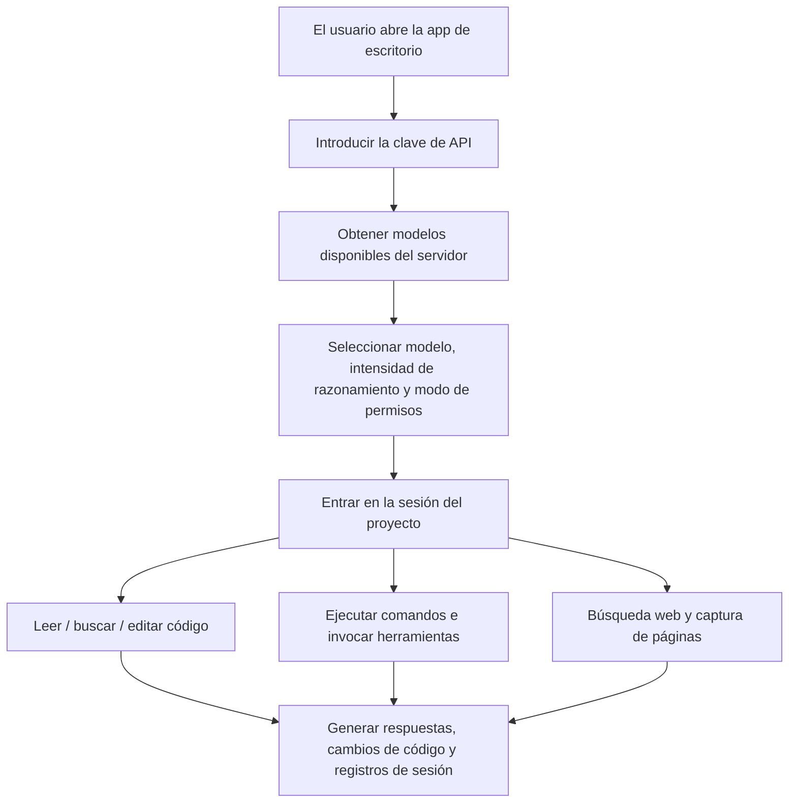
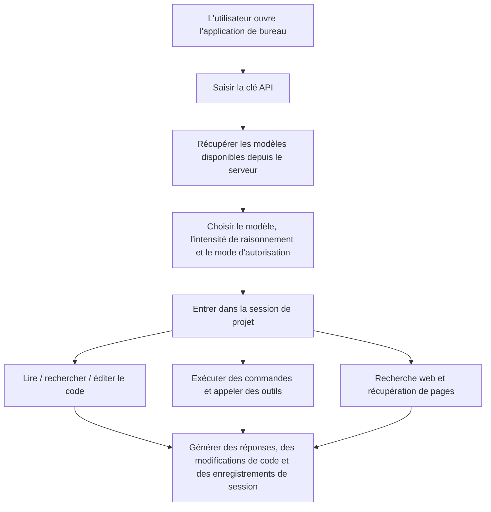
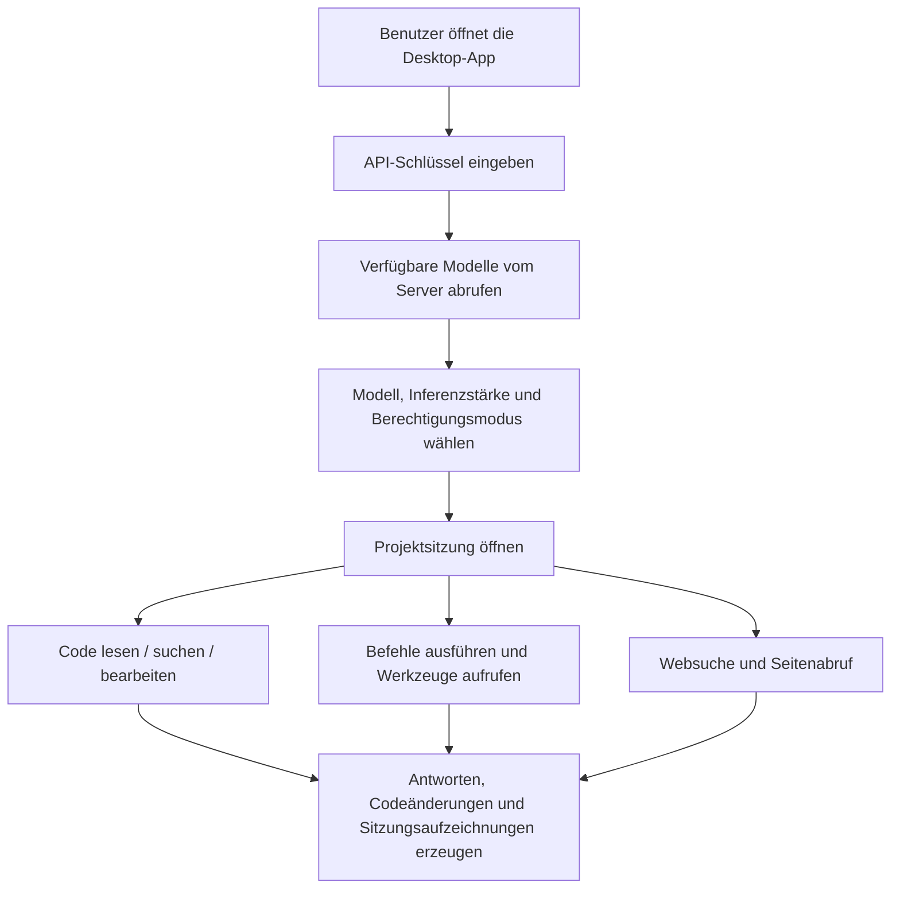

# 白白国产大模型

<div align="center">

[](#简体中文)
[](#english)
[](#繁體中文)
[](#日本語)
[](#한국어)
[](#español)
[](#français)
[](#deutsch)

</div>

白白国产大模型是基于 [NanmiCoder/cc-haha](https://github.com/NanmiCoder/cc-haha) 定制的桌面端 Agent 工作台，面向普通用户提供开箱即用的 Windows / macOS / Linux 图形界面。

本版本默认接入 `https://ai.xkxkbbk.cloud`，首次启动后输入密钥即可获取模型并开始使用。内置代码 Agent 常用工具，支持项目目录、文件读取与编辑、命令执行、联网检索、任务清单和会话管理等能力。

## 下载

正式安装包放在 GitHub Releases：

[下载最新版本](https://github.com/bai936191-afk/baibai-guochan-llm/releases/latest)

当前版本：`v0.4.3`

| 系统 | 推荐文件 |
| --- | --- |
| Windows x64 | `Baibai-Guochan-LLM-0.4.3-win-x64.exe` |
| macOS Apple Silicon | `Baibai-Guochan-LLM-0.4.3-mac-arm64.dmg` |
| macOS Intel | `Baibai-Guochan-LLM-0.4.3-mac-x64.dmg` |
| Linux x64 | `Baibai-Guochan-LLM-0.4.3-linux-x86_64.AppImage` 或 `Baibai-Guochan-LLM-0.4.3-linux-amd64.deb` |
| Linux ARM64 | `Baibai-Guochan-LLM-0.4.3-linux-arm64.AppImage` 或 `Baibai-Guochan-LLM-0.4.3-linux-arm64.deb` |

> 当前构建未配置商业代码签名。Windows 和 macOS 首次安装时可能出现系统安全确认，这是未签名安装包的正常提示。
> 下载文件名使用 ASCII，安装后的应用名称仍显示为“白白国产大模型”。

## 产品蓝图

### 简体中文



### English



### 繁體中文



### 日本語



### 한국어



### Español



### Français



### Deutsch



### 已完成

- 桌面端安装包：Windows x64、macOS ARM64、macOS x64、Linux x64、Linux ARM64。
- 默认服务地址：`https://ai.xkxkbbk.cloud`。
- 首次启动密钥输入流程。
- 从服务端获取模型列表，不再依赖固定官方模型。
- 内置 Agent 工具：文件、搜索、命令、网页、任务、笔记等。
- 中文目录和中文文件名工具调用兼容。
- 基础中文界面与中文安装说明。
- 会话导出、复制会话 ID、回溯到此点等会话操作。
- GitHub Actions 全平台自动打包。
- Release 长期下载入口。

### 多语言蓝图

| 阶段 | 语言与范围 |
| --- | --- |
| 当前版本 | 简体中文为主，保留部分英文技术术语。 |
| 下一阶段 | 增加 English 界面、README、Release Notes 和安装说明。 |
| 后续扩展 | 支持繁体中文、日本语、한국어、Español、Français、Deutsch 等语言包。 |
| 覆盖范围 | 主界面、设置页、权限弹窗、错误提示、模型能力标签、安装器文案、更新说明。 |

### 后续计划

- 补充正式代码签名，降低 Windows SmartScreen 和 macOS Gatekeeper 提示。
- 改进模型能力展示，让推理、图像、上下文窗口等信息完全来自服务端。
- 完善多语言系统，支持用户在设置中切换语言。
- 完善自动更新链路，优先适配 Release 中的 `latest*.yml` 元数据。
- 增强工具调用容错，继续兼容模型偶发的错误参数名。
- 增加更多端到端测试，覆盖文件附件、图片附件、长会话和中断恢复。

## 安装

### Windows

1. 下载 `Baibai-Guochan-LLM-0.4.3-win-x64.exe`。
2. 双击运行安装程序。
3. 选择安装路径，完成安装。
4. 打开桌面快捷方式，输入密钥。

### macOS

1. 根据芯片下载 `mac-arm64.dmg` 或 `mac-x64.dmg`。
2. 打开 DMG，将应用拖入 Applications。
3. 如果系统提示无法打开，前往系统设置的安全性页面允许一次，或使用 Release 中的 `install-macos-unsigned.sh` 辅助安装。

### Linux

AppImage：

```bash
chmod +x Baibai-Guochan-LLM-0.4.3-linux-x86_64.AppImage
./Baibai-Guochan-LLM-0.4.3-linux-x86_64.AppImage
```

Debian / Ubuntu：

```bash
sudo apt install ./Baibai-Guochan-LLM-0.4.3-linux-amd64.deb
```

ARM64 设备请使用文件名里带 `arm64` 的包。

## 开发

```bash
bun install
cd desktop
bun install
bun run dev
```

常用验证：

```bash
cd desktop
bun run lint
bun test ../scripts/quality-gate/package-smoke/index.test.ts
```

本地 Windows 打包：

```powershell
cd desktop
bun run build:windows-x64
```

## 上游声明

本项目是基于 [NanmiCoder/cc-haha](https://github.com/NanmiCoder/cc-haha) 的定制版本。请保留上游项目声明、许可证和免责声明。

上游项目基于 2026-03-31 从 Anthropic npm registry 泄露的 Claude Code 源码修复而来，仅供学习和研究使用。原始源码版权归 Anthropic 所有。

## 许可证与发布说明

- 本仓库当前建议保持私有发布。
- 重新分发、公开开源或商业使用前，请先确认上游许可证和相关代码来源风险。
- Release 中的安装包由 GitHub Actions 构建，未配置商业代码签名证书。
