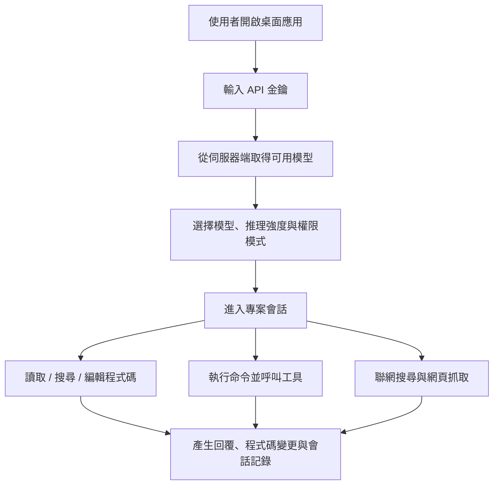

# 白白國產大模型

<div align="center">

[](README.md)
[](README.en.md)
[](README.zh-TW.md)
[](README.ja.md)
[](README.ko.md)
[](README.es.md)
[](README.fr.md)
[](README.de.md)

</div>

白白國產大模型是基於 [NanmiCoder/cc-haha](https://github.com/NanmiCoder/cc-haha) 定製的桌面端 Agent 工作台，面向普通使用者提供開箱即用的 Windows / macOS / Linux 圖形介面。

本版本預設接入 `https://ai.xkxkbbk.cloud`，首次啟動後輸入金鑰即可取得模型並開始使用。內建程式碼 Agent 常用工具，支援專案目錄、檔案讀取與編輯、命令執行、聯網檢索、任務清單與會話管理等能力。

## 下載

正式安裝包放在 GitHub Releases：

[下載最新版本](https://github.com/bai936191-afk/baibai-guochan-llm/releases/latest)

當前版本：`v0.4.4`

| 系統 | 推薦檔案 |
| --- | --- |
| Windows x64 | `Baibai-Guochan-LLM-0.4.4-win-x64.exe` |
| macOS Apple Silicon | `Baibai-Guochan-LLM-0.4.4-mac-arm64.dmg` |
| macOS Intel | `Baibai-Guochan-LLM-0.4.4-mac-x64.dmg` |
| Linux x64 | `Baibai-Guochan-LLM-0.4.4-linux-x86_64.AppImage` 或 `Baibai-Guochan-LLM-0.4.4-linux-amd64.deb` |
| Linux ARM64 | `Baibai-Guochan-LLM-0.4.4-linux-arm64.AppImage` 或 `Baibai-Guochan-LLM-0.4.4-linux-arm64.deb` |

> 當前建置未設定商業程式碼簽章。Windows 與 macOS 首次安裝時可能出現系統安全確認，這是未簽章安裝包的正常提示。
> 下載檔名使用 ASCII，安裝後的應用名稱仍顯示為「白白國產大模型」。

## 產品藍圖



### 已完成

- 桌面端安裝包：Windows x64、macOS ARM64、macOS x64、Linux x64、Linux ARM64。
- 預設服務位址：`https://ai.xkxkbbk.cloud`。
- 首次啟動金鑰輸入流程。
- 從伺服器端取得模型列表，不再依賴固定官方模型。
- 內建 Agent 工具：檔案、搜尋、命令、網頁、任務、筆記等。
- 中文目錄與中文檔名工具呼叫相容。
- 基礎中文介面與中文安裝說明。
- 會話匯出、複製會話 ID、回溯到此點等會話操作。
- GitHub Actions 全平台自動打包。
- Release 長期下載入口。

### 多語言藍圖

| 階段 | 語言與範圍 |
| --- | --- |
| 當前版本 | 簡體中文為主，保留部分英文技術術語。 |
| 下一階段 | 增加 English 介面、README、Release Notes 與安裝說明。 |
| 後續擴充 | 支援繁體中文、日本語、한국어、Español、Français、Deutsch 等語言包。 |
| 覆蓋範圍 | 主介面、設定頁、權限彈窗、錯誤提示、模型能力標籤、安裝器文案、更新說明。 |

### 後續計畫

- 補充正式程式碼簽章，降低 Windows SmartScreen 與 macOS Gatekeeper 提示。
- 改進模型能力展示，讓推理、影像、上下文視窗等資訊完全來自伺服器端。
- 完善多語言系統，支援使用者在設定中切換語言。
- 完善自動更新鏈路，優先適配 Release 中的 `latest*.yml` 中繼資料。
- 增強工具呼叫容錯，繼續相容模型偶發的錯誤參數名。
- 增加更多端到端測試，覆蓋檔案附件、圖片附件、長會話與中斷復原。

## 安裝

### Windows

1. 下載 `Baibai-Guochan-LLM-0.4.4-win-x64.exe`。
2. 雙擊執行安裝程式。
3. 選擇安裝路徑，完成安裝。
4. 開啟桌面捷徑，輸入金鑰。

### macOS

1. 依據晶片下載 `mac-arm64.dmg` 或 `mac-x64.dmg`。
2. 開啟 DMG，將應用拖入 Applications。
3. 若系統提示無法開啟，前往系統設定的安全性頁面允許一次，或使用 Release 中的 `install-macos-unsigned.sh` 輔助安裝。

### Linux

AppImage：

```bash
chmod +x Baibai-Guochan-LLM-0.4.4-linux-x86_64.AppImage
./Baibai-Guochan-LLM-0.4.4-linux-x86_64.AppImage
```

Debian / Ubuntu：

```bash
sudo apt install ./Baibai-Guochan-LLM-0.4.4-linux-amd64.deb
```

ARM64 裝置請使用檔名裡帶 `arm64` 的包。

## 開發

```bash
bun install
cd desktop
bun install
bun run dev
```

常用驗證：

```bash
cd desktop
bun run lint
bun test ../scripts/quality-gate/package-smoke/index.test.ts
```

本地 Windows 打包：

```powershell
cd desktop
bun run build:windows-x64
```

## 上游聲明

本專案是基於 [NanmiCoder/cc-haha](https://github.com/NanmiCoder/cc-haha) 的定製版本。請保留上游專案聲明、授權與免責聲明。

上游專案基於 2026-03-31 從 Anthropic npm registry 洩露的 Claude Code 原始碼修復而來，僅供學習與研究使用。原始原始碼版權歸 Anthropic 所有。

## 授權與發布說明

- 本倉庫當前建議保持私有發布。
- 重新分發、公開開源或商業使用前，請先確認上游授權與相關程式碼來源風險。
- Release 中的安裝包由 GitHub Actions 建置，未設定商業程式碼簽章憑證。
