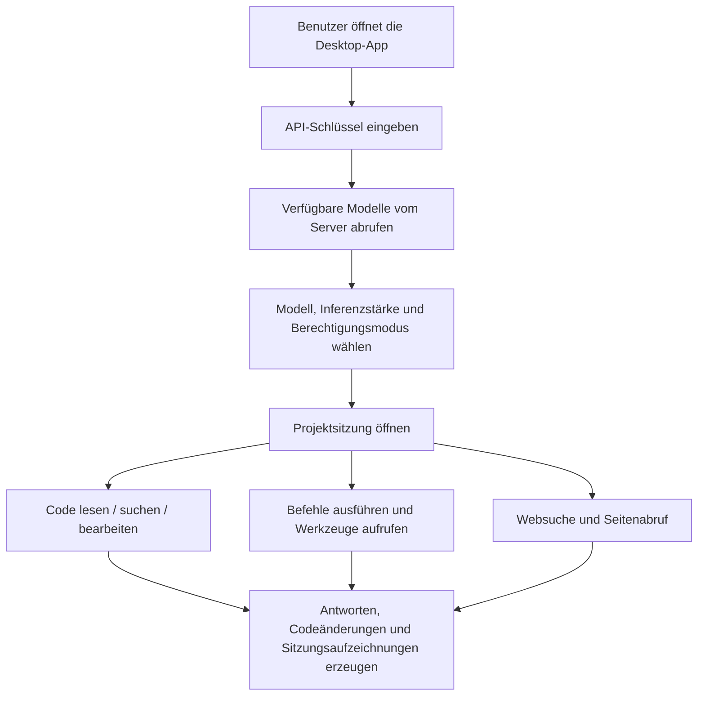

# Produktbauplan / Deutsch

Produktflussdiagramm für Baibai Guochan LLM.

```mermaid
flowchart TD
  A["Benutzer öffnet die Desktop-App"] --> B["API-Schlüssel eingeben"]
  B --> C["Verfügbare Modelle vom Server abrufen"]
  C --> D["Modell, Inferenzstärke und Berechtigungsmodus wählen"]
  D --> E["Projektsitzung öffnen"]
  E --> F["Code lesen / suchen / bearbeiten"]
  E --> G["Befehle ausführen und Werkzeuge aufrufen"]
  E --> H["Websuche und Seitenabruf"]
  F --> I["Antworten, Codeänderungen und Sitzungsaufzeichnungen erzeugen"]
  G --> I
  H --> I
```
