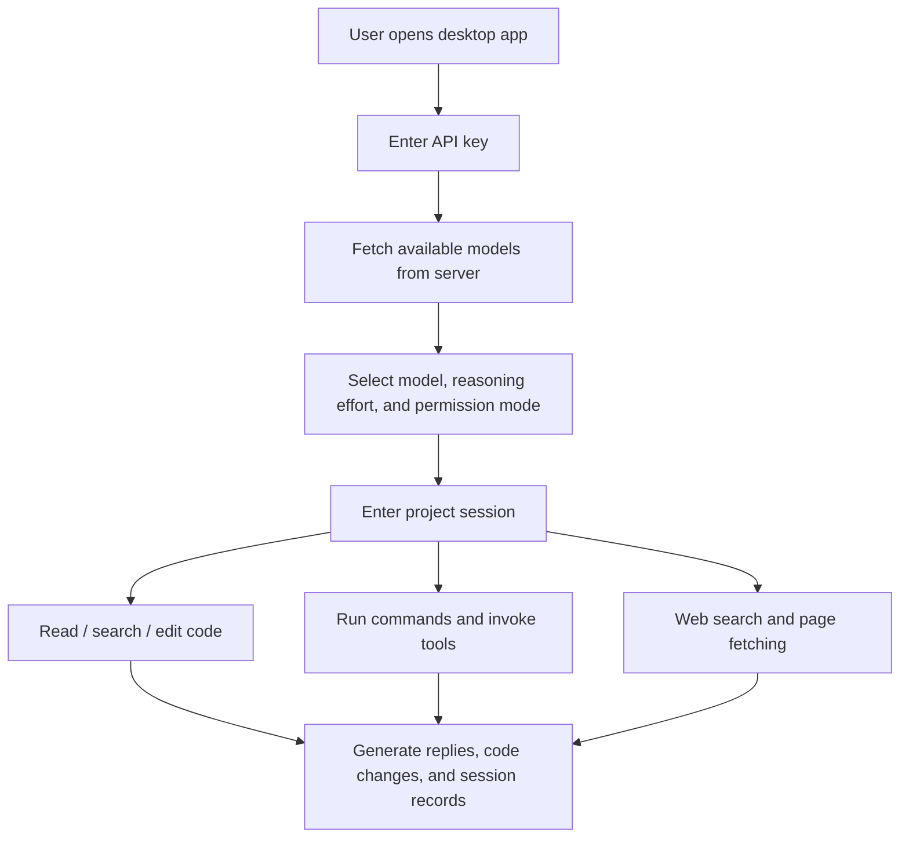

# Product Blueprint / English

Product flow diagram for Baibai Guochan LLM.

```mermaid
flowchart TD
  A["User opens desktop app"] --> B["Enter API key"]
  B --> C["Fetch available models from server"]
  C --> D["Select model, reasoning effort, and permission mode"]
  D --> E["Enter project session"]
  E --> F["Read / search / edit code"]
  E --> G["Run commands and invoke tools"]
  E --> H["Web search and page fetching"]
  F --> I["Generate replies, code changes, and session records"]
  G --> I
  H --> I
```
