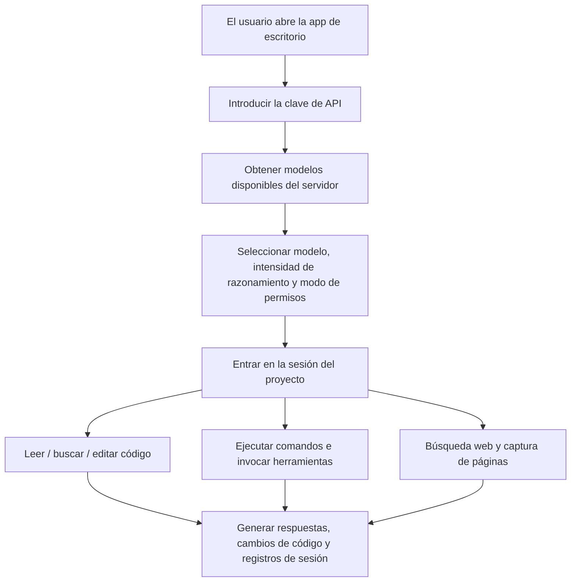

# Diagrama de Producto / Español

Diagrama de flujo del producto para Baibai Guochan LLM.

```mermaid
flowchart TD
  A["El usuario abre la app de escritorio"] --> B["Introducir la clave de API"]
  B --> C["Obtener modelos disponibles del servidor"]
  C --> D["Seleccionar modelo, intensidad de razonamiento y modo de permisos"]
  D --> E["Entrar en la sesión del proyecto"]
  E --> F["Leer / buscar / editar código"]
  E --> G["Ejecutar comandos e invocar herramientas"]
  E --> H["Búsqueda web y captura de páginas"]
  F --> I["Generar respuestas, cambios de código y registros de sesión"]
  G --> I
  H --> I
```
