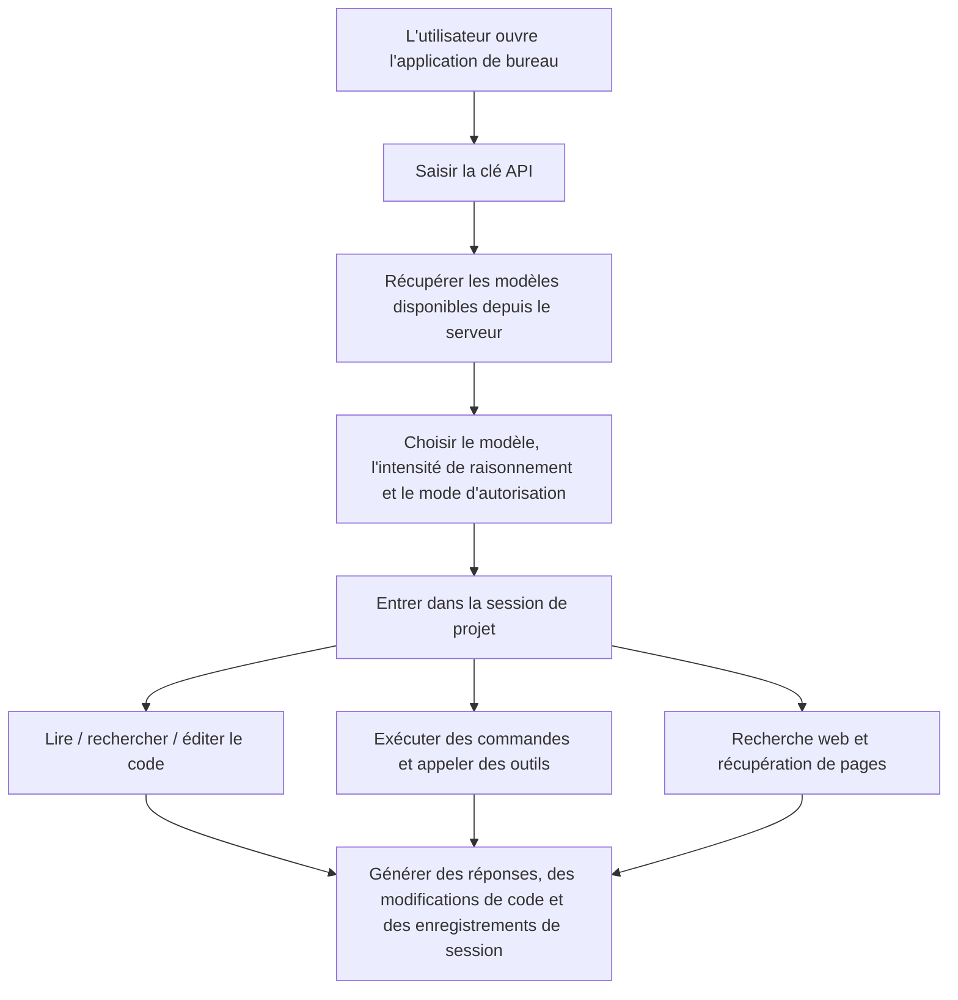

# Diagramme de Produit / Français

Diagramme de flux du produit pour Baibai Guochan LLM.

```mermaid
flowchart TD
  A["L'utilisateur ouvre l'application de bureau"] --> B["Saisir la clé API"]
  B --> C["Récupérer les modèles disponibles depuis le serveur"]
  C --> D["Choisir le modèle, l'intensité de raisonnement et le mode d'autorisation"]
  D --> E["Entrer dans la session de projet"]
  E --> F["Lire / rechercher / éditer le code"]
  E --> G["Exécuter des commandes et appeler des outils"]
  E --> H["Recherche web et récupération de pages"]
  F --> I["Générer des réponses, des modifications de code et des enregistrements de session"]
  G --> I
  H --> I
```
