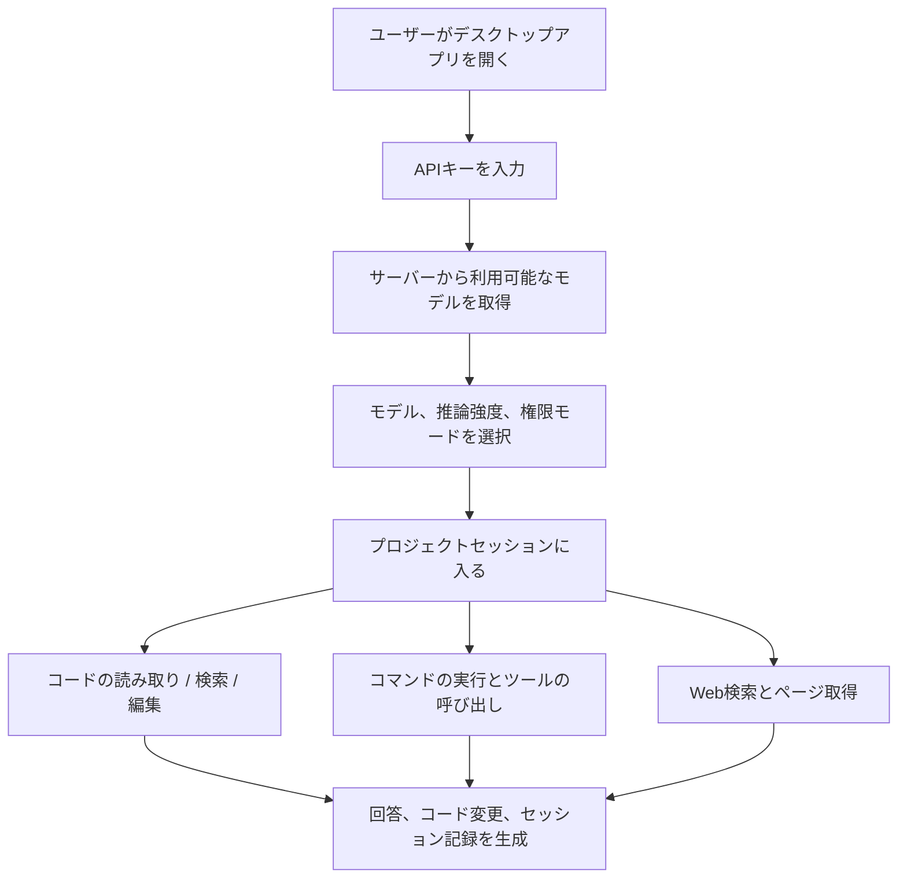

# 製品ブループリント / 日本語

白白国産大モデルの製品フロー図。

```mermaid
flowchart TD
  A["ユーザーがデスクトップアプリを開く"] --> B["APIキーを入力"]
  B --> C["サーバーから利用可能なモデルを取得"]
  C --> D["モデル、推論強度、権限モードを選択"]
  D --> E["プロジェクトセッションに入る"]
  E --> F["コードの読み取り / 検索 / 編集"]
  E --> G["コマンドの実行とツールの呼び出し"]
  E --> H["Web検索とページ取得"]
  F --> I["回答、コード変更、セッション記録を生成"]
  G --> I
  H --> I
```
