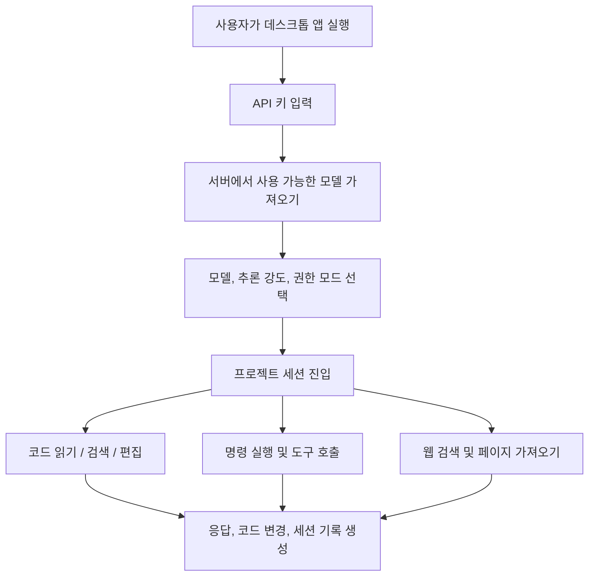

# 제품 청사진 / 한국어

白白 국산 대모델의 제품 흐름도.

```mermaid
flowchart TD
  A["사용자가 데스크톱 앱 실행"] --> B["API 키 입력"]
  B --> C["서버에서 사용 가능한 모델 가져오기"]
  C --> D["모델, 추론 강도, 권한 모드 선택"]
  D --> E["프로젝트 세션 진입"]
  E --> F["코드 읽기 / 검색 / 편집"]
  E --> G["명령 실행 및 도구 호출"]
  E --> H["웹 검색 및 페이지 가져오기"]
  F --> I["응답, 코드 변경, 세션 기록 생성"]
  G --> I
  H --> I
```
