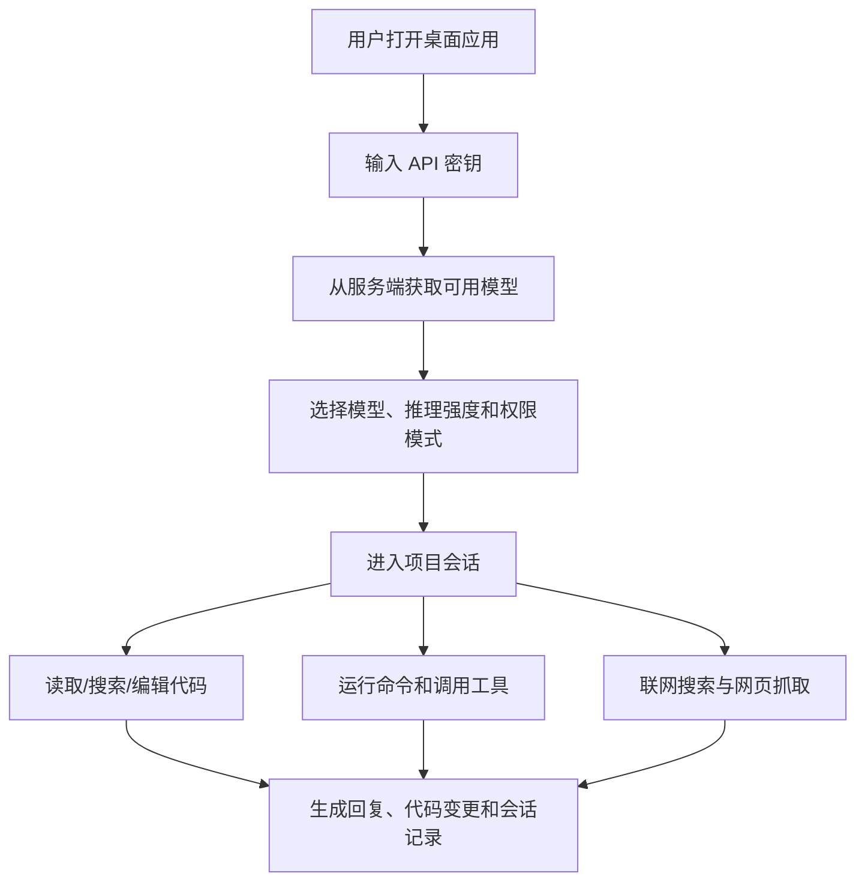

# 产品蓝图 / 简体中文

白白国产大模型的产品流程图。

```mermaid
flowchart TD
  A["用户打开桌面应用"] --> B["输入 API 密钥"]
  B --> C["从服务端获取可用模型"]
  C --> D["选择模型、推理强度和权限模式"]
  D --> E["进入项目会话"]
  E --> F["读取/搜索/编辑代码"]
  E --> G["运行命令和调用工具"]
  E --> H["联网搜索与网页抓取"]
  F --> I["生成回复、代码变更和会话记录"]
  G --> I
  H --> I
```
