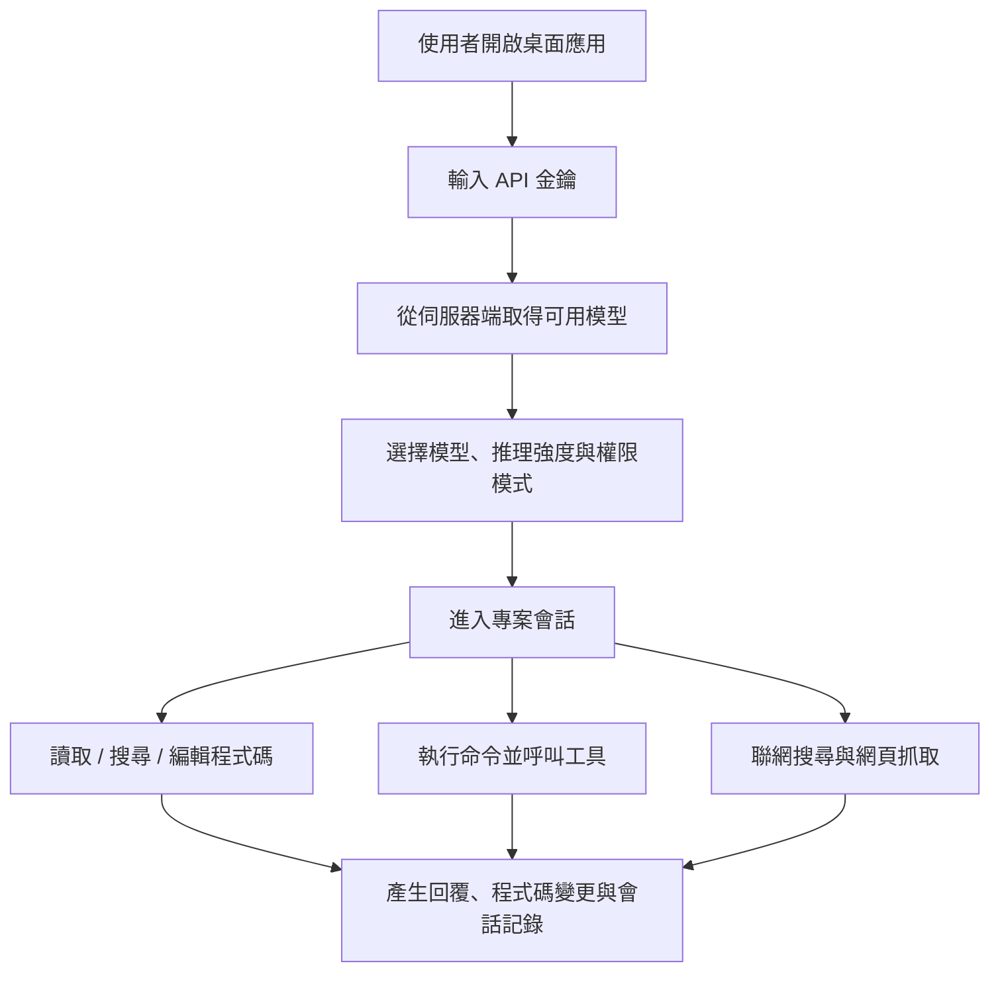

# 產品藍圖 / 繁體中文

白白國產大模型的產品流程圖。

```mermaid
flowchart TD
  A["使用者開啟桌面應用"] --> B["輸入 API 金鑰"]
  B --> C["從伺服器端取得可用模型"]
  C --> D["選擇模型、推理強度與權限模式"]
  D --> E["進入專案會話"]
  E --> F["讀取 / 搜尋 / 編輯程式碼"]
  E --> G["執行命令並呼叫工具"]
  E --> H["聯網搜尋與網頁抓取"]
  F --> I["產生回覆、程式碼變更與會話記錄"]
  G --> I
  H --> I
```
